# <div align="center">⚡ Saodatov Jamshidbek ⚡</div>
<div align="center"></div>

<p align="center">
  
  
  <a href="https://wakatime.com/@rinkuo"></a>
</p>

<div align="center">
  
</div>

## 🚀 About Me

```javascript
const jamshidbek = {
  pronouns: "he" | "him",
  code: ["Python", "C++", "C#", "JavaScript"],
  tools: ["Django", "PostgreSQL", "Docker", "Git"],
  interests: ["Backend Development", "Algorithms", "AI/ML", "Game Development"],
  challenge: "Solving complex problems with elegant solutions"
};
```

<div align="center">
  
</div>

## 💫 Current Focus

<table align="center">
  <tr>
    <td align="center" width="96">
      <a href="#">
        
      </a>
      <br>Python
    </td>
    <td align="center" width="96">
      <a href="#">
        
      </a>
      <br>C++
    </td>
    <td align="center" width="96">
      <a href="#">
        
      </a>
      <br>Django
    </td>
    <td align="center" width="96">
      <a href="#">
        
      </a>
      <br>Docker
    </td>
    <td align="center" width="96">
      <a href="#">
        
      </a>
      <br>GitHub
    </td>
    <td align="center" width="96">
      <a href="#">
        
      </a>
      <br>REST API
    </td>
  </tr>
</table>

## 📈 GitHub Stats

<div align="center">
  
</div>

<p align="center">
  
  
</p>

<p align="center">
  
</p>

## 🌱 Currently Learning

- Advanced backend architectures with Python
- Data structures & algorithms optimization
- AI/ML integration in backend systems
- Game engine development with C++ and C#

## 🔮 My Development Journey

```mermaid
graph LR
    A[Learning Basics] --> B[Backend Development]
    B --> C[Advanced Algorithms]
    C --> D[AI & ML Integration]
    D --> E[Game Development]
    E --> F[Future Innovation]
    style A fill:#3a0ca3,stroke:#4361ee,color:#fff
    style B fill:#4361ee,stroke:#4361ee,color:#fff
    style C fill:#4cc9f0,stroke:#4361ee,color:#111
    style D fill:#4cc9f0,stroke:#4361ee,color:#111
    style E fill:#f72585,stroke:#4361ee,color:#fff
    style F fill:#f72585,stroke:#4361ee,color:#fff
```



## 🤝 Connect With Me

<div align="center">
  <a href="mailto:rinkusoft77@gmail.com">
    
  </a>
  <a href="https://twitter.com/rinkuo_dev">
    
  </a>
  <a href="https://www.linkedin.com/in/saodatovjamshidbek">
    
  </a>
  <a href="https://dev.to/rinku">
    
  </a>
  <a href="https://instagram.com/abubakr_o_0">
    
  </a>
  <a href="https://www.youtube.com/c/rinkuo">
    
  </a>
  <a href="https://www.leetcode.com/rinkuo07">
    
  </a>
  <a href="https://discord.gg/clay04782">
    
  </a>
</div>

## 🔧 Technologies & Tools

<p align="center">
  
  
  
  
  
  
  
  
  
  
  
</p>

## 📅 Weekly Development Breakdown

<!--START_SECTION:waka-->
```text
Python       ██████████████▓░░░░░░  60.25%
C++          ████████░░░░░░░░░░░░░  30.15%
SQL          ███░░░░░░░░░░░░░░░░░░  05.30%
Docker       █░░░░░░░░░░░░░░░░░░░░  03.20%
Other        ▓░░░░░░░░░░░░░░░░░░░░  01.10%
```
<!--END_SECTION:waka-->

<div align="center">
  
</div>
