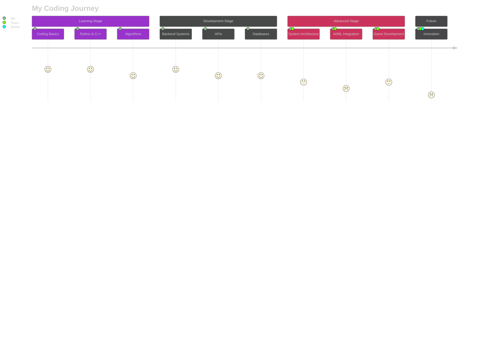

# <div align="center">✨ SAODATOV JAMSHIDBEK ✨</div>

<div align="center">
  

  

  <br>
  <a href="https://git.io/typing-svg"></a>
</div>

<p align="center">
  
  
</p>

<div align="center">
  
</div>

## <div align="center">🎮 **Passion Meets Code** 🎮</div>

<div>
  
  
  - 🔭 I'm currently working on **Advanced Backend Systems**
  
  - 🌱 I'm mastering **Django, C++, and Microservices**
  
  - 👯 I'm looking to collaborate on **Open Source Projects**
  
  - 🤔 I'm exploring **AI & ML for Backend Integration**
  
  - 💬 Ask me about **Python, Algorithms, System Design**
  
  - ⚡ Fun fact: **I can solve a Rubik's cube in under 2 minutes!**
</div>

## <div align="center">🌈 **My Digital Persona** 🌈</div>

```javascript
const jamshidbek = {
  pronouns: "he" | "him",
  code: ["Python", "C++", "C#", "JavaScript"],
  tools: ["Django", "PostgreSQL", "Docker", "Git"],
  architecture: ["microservices", "event-driven", "design patterns"],
  interests: ["Backend Development", "Algorithms", "AI/ML", "Game Development"],
  challenge: "Solving complex problems with elegant solutions",
  funFact: "My code is like my coffee - strong, efficient, and sometimes keeps me up at night! ☕"
};
```

<div align="center">
  
</div>

## <div align="center">🏆 **Achievements** 🏆</div>

<div align="center">
  
</div>

## <div align="center">🚀 **Tech Universe** 🚀</div>

<table align="center">
  <tr>
    <td align="center" width="96">
      <a href="#">
        
      </a>
      <br>Python 🐍
    </td>
    <td align="center" width="96">
      <a href="#">
        
      </a>
      <br>C++ 🔧
    </td>
    <td align="center" width="96">
      <a href="#">
        
      </a>
      <br>Django 🌐
    </td>
    <td align="center" width="96">
      <a href="#">
        
      </a>
      <br>Docker 🐳
    </td>
    <td align="center" width="96">
      <a href="#">
        
      </a>
      <br>GitHub 🔄
    </td>
    <td align="center" width="96">
      <a href="#">
        
      </a>
      <br>REST API 📡
    </td>
  </tr>
  <tr>
    <td align="center" width="96">
      <a href="#">
        
      </a>
      <br>PostgreSQL 🛢️
    </td>
    <td align="center" width="96">
      <a href="#">
        
      </a>
      <br>Git 📝
    </td>
    <td align="center" width="96">
      <a href="#">
        
      </a>
      <br>Unity 🎮
    </td>
    <td align="center" width="96">
      <a href="#">
        
      </a>
      <br>Unreal 🎲
    </td>
    <td align="center" width="96">
      <a href="#">
        
      </a>
      <br>Blender 🎨
    </td>
    <td align="center" width="96">
      <a href="#">
        
      </a>
      <br>Scala ⚙️
    </td>
  </tr>
</table>

<div align="center">
  
</div>

## <div align="center">📊 **GitHub Analytics** 📊</div>

<p align="center">
  <a href="https://github.com/rinkuo">
    
    
  </a>
</p>

<p align="center">
  
</p>

<div align="center">
  
</div>

<div align="center">
  
</div>

## <div align="center">🌠 **Coding Journey** 🌠</div>

<div align="center">
  
</div>



## <div align="center">⚡ **Weekly Dev Breakdown** ⚡</div>

<div align="center">
  
</div>

<!--START_SECTION:waka-->
```text
Python       ████████████████░░░░░  60.25% 🐍
C++          ███████████░░░░░░░░░░  30.15% 🔧
SQL          ████░░░░░░░░░░░░░░░░░  05.30% 📊
Docker       ██░░░░░░░░░░░░░░░░░░░  03.20% 🐳
Other        █░░░░░░░░░░░░░░░░░░░░  01.10% 🔍
```
<!--END_SECTION:waka-->

## <div align="center">🔥 **Connect With Me** 🔥</div>

<div align="center">
  <a href="mailto:rinkusoft77@gmail.com">
    
  </a>
  <a href="https://twitter.com/rinkuo_dev">
    
  </a>
  <a href="https://www.linkedin.com/in/saodatovjamshidbek">
    
  </a>
  <a href="https://dev.to/rinku">
    
  </a>
  <a href="https://instagram.com/abubakr_o_0">
    
  </a>
  <a href="https://www.youtube.com/c/rinkuo">
    
  </a>
  <a href="https://www.leetcode.com/rinkuo07">
    
  </a>
  <a href="https://discord.gg/clay04782">
    
  </a>
</div>

<div align="center">
  
</div>

## <div align="center">📌 **Pinned Projects** 📌</div>

<div align="center">
  <a href="https://github.com/rinkuo/project1">
    
  </a>
  <a href="https://github.com/rinkuo/project2">
    
  </a>
</div>

## <div align="center">💭 **Random Dev Quote** 💭</div>

<div align="center">
  
</div>

<div align="center">
  
</div>
