<h1 align="center">
  
</h1>

 
  
   
  
  
 

    
  

  
  

    
    
    
    
    
    
    
    
  

    
    
    

    
    

  

  

  

## 
💫 **About Me** 💫

  
  
  - 🔭 Building **Scalable Backend Systems** & **Game Development Tools**
  
  - 🧪 Experimenting with **ML-Enhanced Microservices** & **AI Integration**
  
  - 👯 Open to collaborating on **Innovative Open Source Projects**
  
  - 💼 Professional experience with **Python**, **Django** & **C++**
  
  - 📚 Currently diving into **Distributed Systems** & **Advanced Game Physics**
  
  - 🎮 Developing a **Procedurally Generated RPG** in my spare time
  
  - ⚡ Fun fact: **I've been collecting vintage programming books since 2016!**

  

## 
🆠**Achievements & Metrics** ğŸ†

  

    
  

  <table>
    <tr>
      <td>
        
      </td>
      <td>
        
      </td>
    </tr>
  </table>

  

    
  

  

  

  
  

  

## 
⚡ **Tech Stack & Skills** ⚡

<table align="center">
  <tr>
    <td align="center" width="96">
      
       Python
    </td>
    <td align="center" width="96">
      
       C++
    </td>
    <td align="center" width="96">
      
       Django
    </td>
    <td align="center" width="96">
      
       Docker
    </td>
    <td align="center" width="96">
      
       GitHub
    </td>
    <td align="center" width="96">
      
       REST API
    </td>
  </tr>
  <tr>
    <td align="center" width="96">
      
       PostgreSQL
    </td>
    <td align="center" width="96">
      
       Git
    </td>
    <td align="center" width="96">
      
       Unity
    </td>
    <td align="center" width="96">
      
       Unreal
    </td>
    <td align="center" width="96">
      
       Blender
    </td>
    <td align="center" width="96">
      
       Scala
    </td>
</table>

  

  

## 
📊 **Language & Technology Usage** 📊

  
  

   &nbsp; &nbsp;

  
  <!-- LeetCode Stats -->
  

  

## 
🚀 **Projects Showcase** 🚀

  

  

## 
🔥 **Connect With Me** 🔥

  
  
  
  
  
  
  

## 
💭 **Random Dev Quote** 💭

  

  

  

